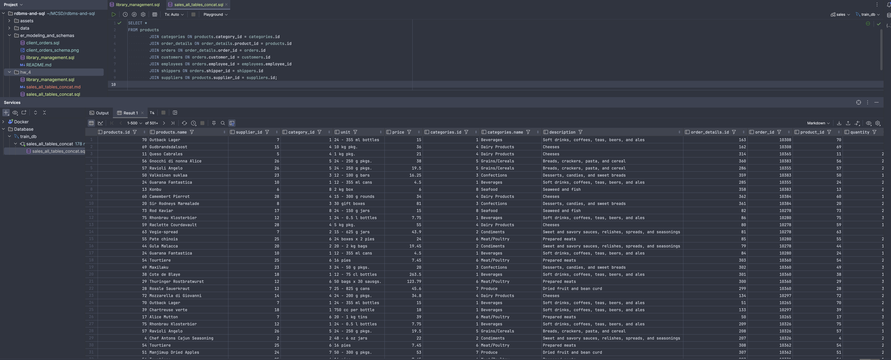
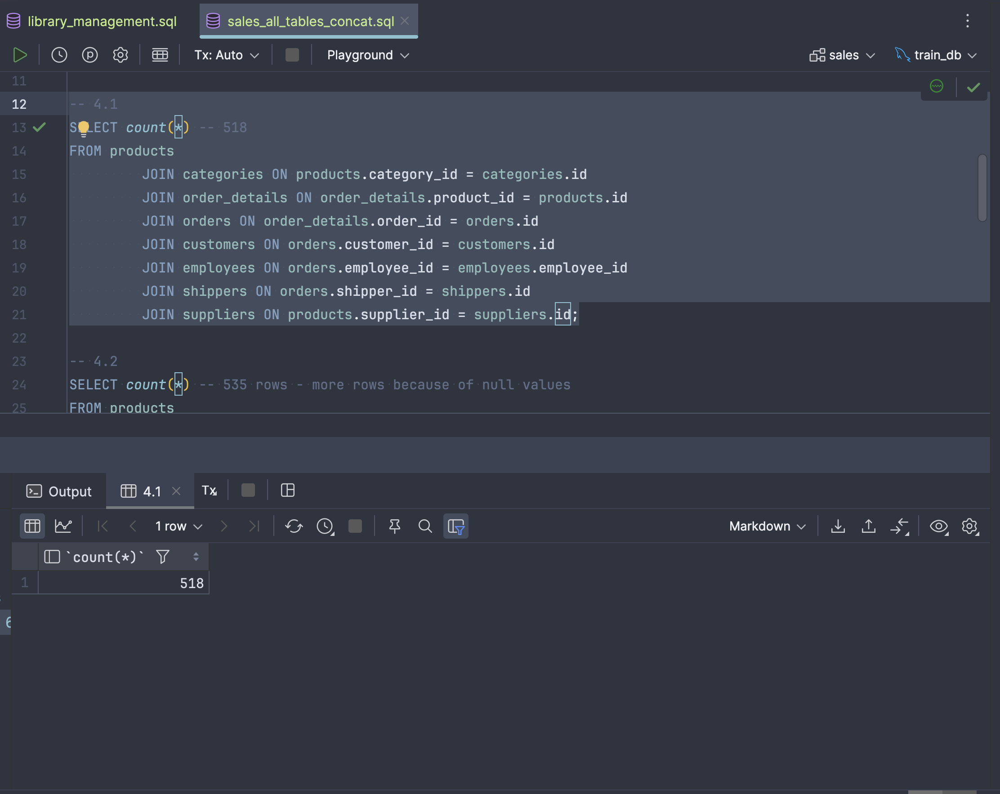
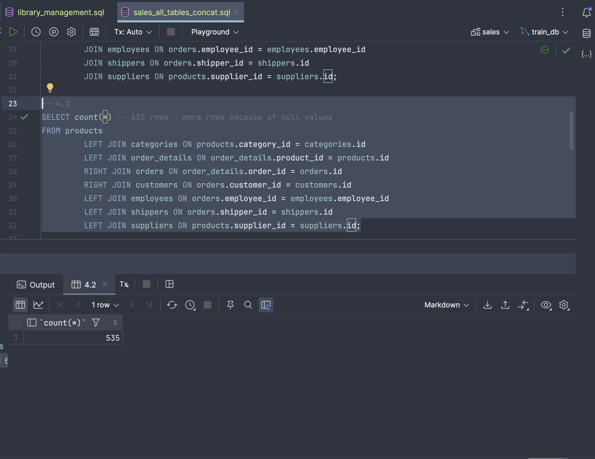
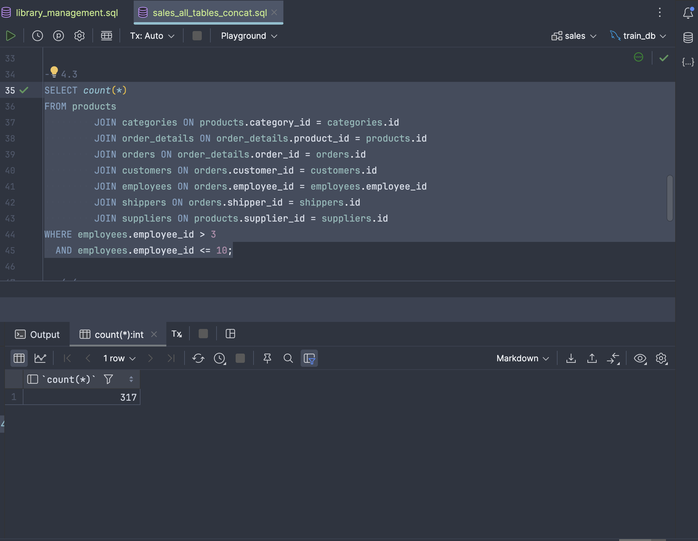
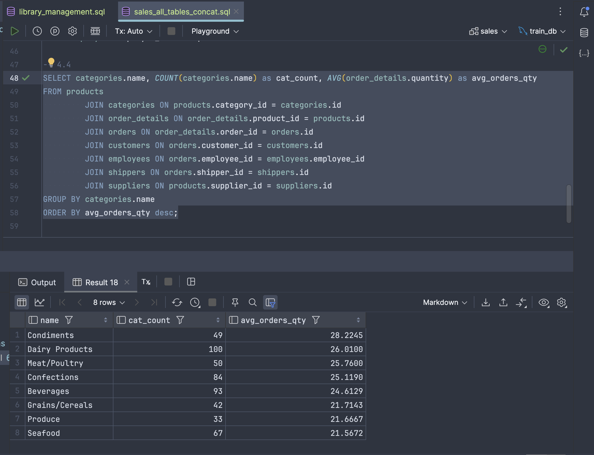
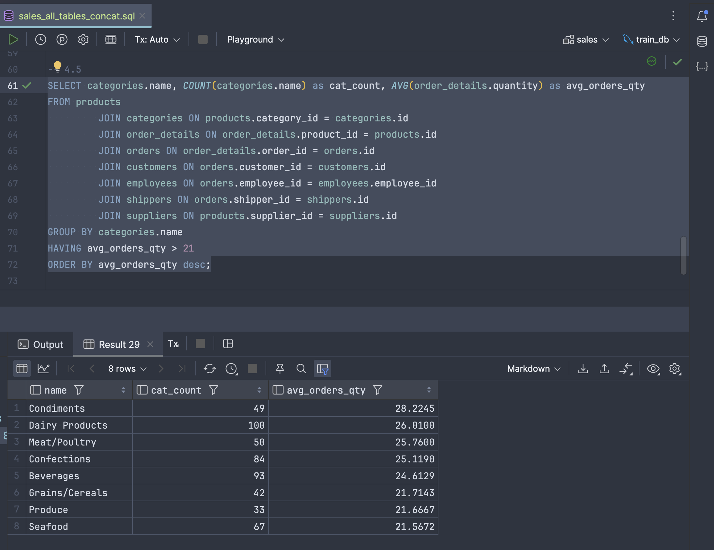
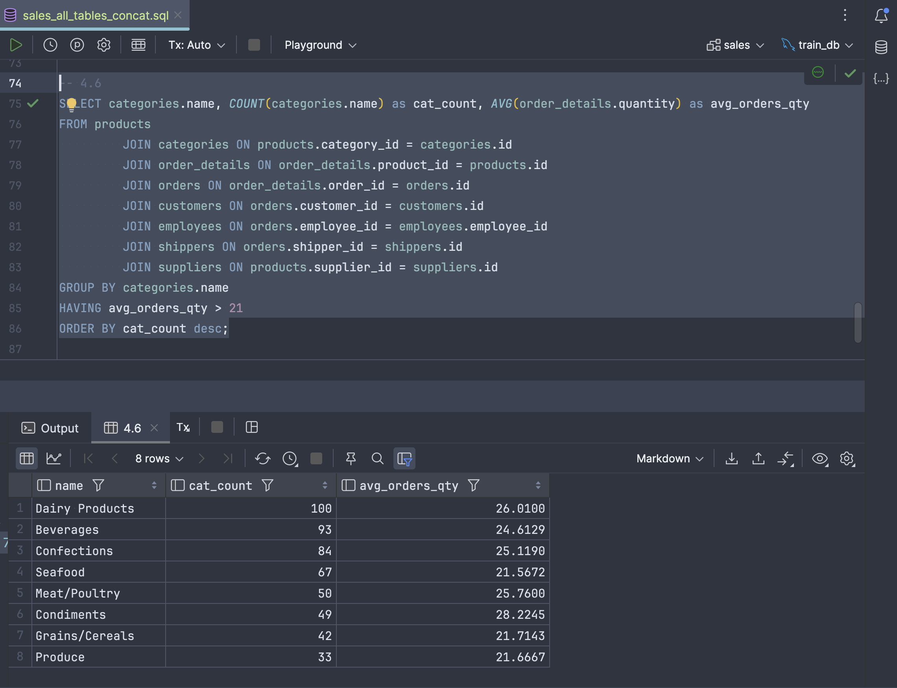
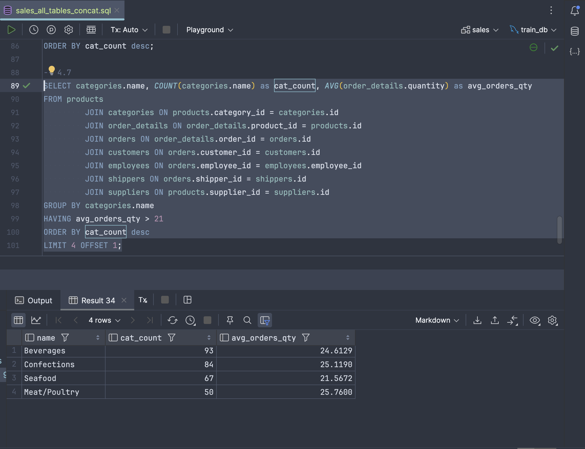

### Library Management schema definition + initial sample schema seed

1. DDL is in [library_management_ddl.sql](./library_management_ddl.sql)

2. DML is in [library_management_dml.sql](./library_management_dml.sql)

### Sales schema - concatenate all tables with JOIN + DQLs

SQL script is in [sales_all_tables_concat.sql](./sales_all_tables_concat.sql)

3

Full results are in [sales_all_tables_concat.md](./sales_all_tables_concat.md)

4_1

4_2

4_3

4_4

4_5

4_6

4_7

